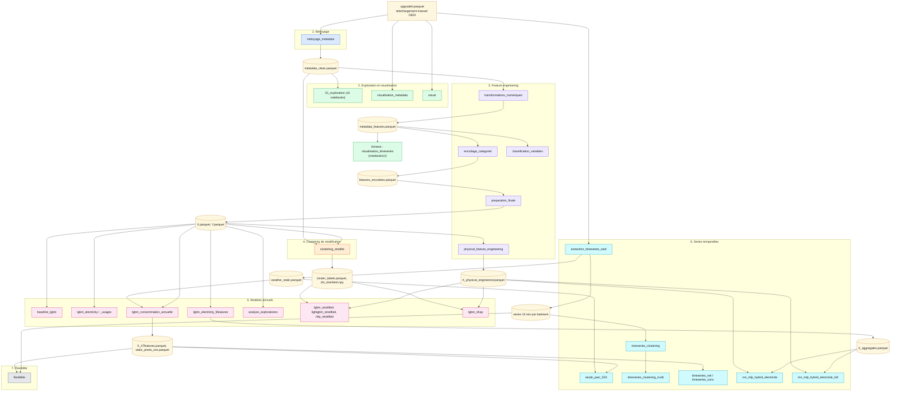

# FlexiMax

Projet de stage Data Science, MINES Paris PSL / ARMINES (programme France 2030, ADEME).

## Objectif

Prédire la consommation énergétique des bâtiments résidentiels à partir des données
ResStock 2025 Release 1 (NREL), analyser la structure de cette consommation
(déterminants climatiques, enveloppe, équipements) et sa dynamique temporelle.
Le périmètre d'étude est restreint aux **bâtiments tout électriques**.

Pour l'enchaînement détaillé des sept étapes (entrées, sorties, notebook par
notebook), voir [PIPELINE.md](PIPELINE.md).

## 1. Récupérer les données avant de commencer

Aucune donnée volumineuse n'est versionnée. Il faut deux choses.

### a. Métadonnées nationales (téléchargement manuel, obligatoire)

Fichier attendu : `data/raw/upgrade0.parquet` (549 971 bâtiments x 771 colonnes,
baseline ResStock 2025.1, métadonnées + résultats annuels).

Source : data lake public OEDI (NREL), aucune clé AWS requise.

- Dossier : `https://data.openei.org/s3_viewer?bucket=oedi-data-lake&prefix=nrel-pds-building-stock%2Fend-use-load-profiles-for-us-building-stock%2F2025%2Fresstock_amy2018_release_1%2Fmetadata_and_annual_results%2Fnational%2Ffull%2Fparquet%2F`
- Fichier : `upgrade0.parquet` (465 060 991 octets, déjà nommé ainsi à la source)
- URL directe (vérifiée) :
  `https://oedi-data-lake.s3.amazonaws.com/nrel-pds-building-stock/end-use-load-profiles-for-us-building-stock/2025/resstock_amy2018_release_1/metadata_and_annual_results/national/full/parquet/upgrade0.parquet`

Télécharger ce fichier et le placer tel quel dans `data/raw/`.

```bash
mkdir -p data/raw
curl -L -o data/raw/upgrade0.parquet \
  "https://oedi-data-lake.s3.amazonaws.com/nrel-pds-building-stock/end-use-load-profiles-for-us-building-stock/2025/resstock_amy2018_release_1/metadata_and_annual_results/national/full/parquet/upgrade0.parquet"
```

Documentation générale : `https://www.nrel.gov/buildings/end-use-load-profiles.html`,
`https://resstock.nrel.gov/`.

### b. Références externes (déjà dans le dépôt)

`data/external/` contient les dictionnaires ResStock nécessaires à la reconstruction
des consignes de thermostat : `options_lookup.tsv`, `data_dictionary.tsv`,
`enumeration_dictionary.tsv`, `map_of_us_states.geojson`.
`options_lookup.tsv` provient du dépôt NREL/resstock (`resources/options_lookup.tsv`).

### c. Séries temporelles et météo (téléchargées automatiquement par les notebooks)

Les profils 15 min par bâtiment et la météo par comté sont tirés à la volée depuis
OEDI par les notebooks de `06_timeseries/`. Détail des cellules concernées en
section 5.

## 2. Environnement

Python 3.12. Dépendances principales : `pandas`, `numpy`, `pyarrow`,
`scikit-learn`, `lightgbm`, `optuna`, `tensorflow`, `torch`, `matplotlib`,
`seaborn`, `shap`, `geopandas`, `kneed`, `plotly`.

Tous les notebooks calculent la racine du projet par
`Path().resolve().parent.parent` : ils doivent rester à leur emplacement
`notebooks/<étape>/`.

## 3. Schéma du pipeline

Un nœud par notebook, coloré par étape ; les fichiers de données sont en jaune.
Le détail entrées/sorties de chaque notebook est dans le tableau de la section 4.



## 4. Ordre d'exécution détaillé

| # | Notebook | Lit | Produit |
|---|---|---|---|
| 0 | placer `data/raw/upgrade0.parquet` | (OEDI) | |
| 1 | `02_nettoyage/nettoyage_metadata.ipynb` | `upgrade0.parquet` | `metadata_clean.parquet` |
| 2a | `01_exploration/exploration_enveloppe_thermique.ipynb` | `metadata_clean.parquet` | figures |
| 2b | `01_exploration/exploration_hvac.ipynb` | `metadata_clean.parquet` | figures |
| 2c | `01_exploration/exploration_occupants.ipynb` | `metadata_clean.parquet` | figures |
| 2d | `01_exploration/exploration_localisation_climat.ipynb` | `metadata_clean.parquet` | figures |
| 2e | `01_exploration/exploration_in_groups.ipynb` | `metadata_clean.parquet` | figures |
| 2f | `03_visualisation/visualisation_metadata.ipynb` | `upgrade0.parquet` | figures |
| 2g | `03_visualisation/visual.ipynb` | `upgrade0.parquet` | figures |
| 3a | `04_features/transformations_numeriques.ipynb` | `metadata_clean.parquet` | `metadata_features.parquet` |
| 3b | `04_features/encodage_categoriel.ipynb` | `metadata_features.parquet` | `features_encodees.parquet` |
| 3c | `04_features/preparation_finale.ipynb` | `features_encodees.parquet` | `X.parquet`, `Y.parquet` |
| 3d | `04_features/physical_feature_engineering.ipynb` | `X.parquet`, `Y.parquet` | `X_physical_engineered.parquet` |
| 3e | `03_visualisation/classification_variables.ipynb` | `metadata_clean.parquet`, `metadata_features.parquet`, `upgrade0.parquet` | `classification_variables_metier.csv` |
| 4 | `05_deeplearning/clustering_stratifie.ipynb` | `X.parquet`, `Y.parquet`, `metadata_clean.parquet` | `cluster_labels.parquet`, `cluster_labels_sub.parquet`, `idx_train.npy`, `idx_test.npy`, `idx_sub_maisons_elec.npy` |
| 5a | `06_timeseries/extraction_timeseries_oedi.ipynb` | `upgrade0.parquet` + OEDI (auto) | `weather_static.parquet`, `nn_buildings.csv`, séries `{bldg_id}-0.parquet` |
| 5b | `05_deeplearning/baseline_lgbm.ipynb` | `X.parquet`, `Y.parquet`, `metadata_clean.parquet` | métriques |
| 5c | `05_deeplearning/lgbm_electricity.ipynb` | `X.parquet`, `Y.parquet`, `metadata_clean.parquet` | métriques |
| 5d | `05_deeplearning/lgbm_electricity_usages.ipynb` | `X.parquet`, `metadata_clean.parquet`, `upgrade0.parquet` | métriques |
| 5e | `05_deeplearning/lgbm_electricity_5features.ipynb` | `X.parquet`, `metadata_clean.parquet`, `upgrade0.parquet` | `X_aggregates.parquet` |
| 5f | `05_deeplearning/lgbm_consommation_annuelle.ipynb` | `X.parquet`, `metadata_clean.parquet`, `upgrade0.parquet`, `weather_static.parquet` | `X_47features.parquet`, `X_features_v2.parquet`, `static_preds_oos.parquet` |
| 5g | `05_deeplearning/analyse_exploratoires.ipynb` | `X.parquet`, `Y.parquet` | figures |
| 5h | `05_deeplearning/lgbm_stratified.ipynb` | `X.parquet`, `X_physical_engineered.parquet`, `Y.parquet`, `cluster_labels.parquet`, `idx_*.npy` | métriques |
| 5i | `05_deeplearning/lightgbm_stratified.ipynb` | `X.parquet`, `Y.parquet`, `cluster_labels.parquet`, `idx_*.npy` | métriques |
| 5j | `05_deeplearning/mlp_stratified.ipynb` | `X.parquet`, `Y.parquet`, `cluster_labels.parquet`, `idx_*.npy` | métriques |
| 5k | `05_deeplearning/lgbm_shap.ipynb` | `X.parquet`, `X_physical_engineered.parquet`, `Y.parquet`, `cluster_labels.parquet`, `idx_*.npy`, `metadata_clean.parquet` | figures SHAP |
| 6a | `06_timeseries/etude_parc_503.ipynb` | `X_47features.parquet`, `metadata_clean.parquet`, `weather_static.parquet`, séries par bâtiment | panel d'étude |
| 6b | `06_timeseries/timeseries_clustering.ipynb` | `data/raw/347201-0.parquet`, `data/raw/timeseries_100_all_electric/` | `clustering_multivarie_jours_types.parquet`, `*.joblib` |
| 6c | `06_timeseries/timeseries_clustering_multi.ipynb` | `347201-0.parquet`, `upgrade0.parquet` + OEDI (auto, ~100 bâtiments) | artefacts de clustering `*.joblib` |
| 6d | `06_timeseries/timeseries_net.ipynb` | `X_47features.parquet`, `metadata_clean.parquet`, `static_preds_oos.parquet`, `nn_buildings_elargi.csv` + OEDI (auto) | métriques |
| 6e | `06_timeseries/timeseries_conv.ipynb` | idem `timeseries_net` | métriques |
| 6f | `06_timeseries/rnn_mlp_hybrid_electricite.ipynb` | `X_aggregates.parquet`, `X_physical_engineered.parquet`, `metadata_clean.parquet` | métriques |
| 6g | `06_timeseries/rnn_mlp_hybrid_electricite_full.ipynb` | `X_aggregates.parquet`, `X_physical_engineered.parquet`, `metadata_clean.parquet`, `upgrade0.parquet` + OEDI (auto, ~6700 bâtiments) | `buildings_full_download_failed.parquet` |
| 7 | `07_flexibilite/flexibilite.ipynb` | `experiments/results/flex_chauffage.json` | figures de gisement |
| annexe | `notebooks1/03_visualisation1/visualisation_timeseries.ipynb` | `metadata_features.parquet` | figures |

## 5. Cellules qui téléchargent automatiquement des données

Tous ces téléchargements visent le data lake public OEDI, sans clé AWS.

| Notebook | Cellule | Ce qu'elle fait |
|---|---|---|
| `06_timeseries/extraction_timeseries_oedi.ipynb` | cellule de code 1 | définit `OEDI_BASE` (séries 15 min) et `WEATHER_BASE` (météo comté) |
| `06_timeseries/extraction_timeseries_oedi.ipynb` | cellule de code 7, fonction `download_timeseries(bldg_id, state)` | `pd.read_parquet("{OEDI_BASE}/state={state}/{bldg_id}-0.parquet")`, injecte les consignes, sauvegarde dans `data/processed/{bldg_id}-0.parquet` |
| `06_timeseries/extraction_timeseries_oedi.ipynb` | cellules de code 8, 10, 11 | appels d'exemple de `download_timeseries` (bâtiment 347201, etc.) |
| `06_timeseries/extraction_timeseries_oedi.ipynb` | cellule de code 13, fonction `download_nn(bldg_id, state, force)` | télécharge le sous-ensemble de colonnes utiles au réseau pour un échantillon stratifié d'environ 500 bâtiments |
| `06_timeseries/extraction_timeseries_oedi.ipynb` | Partie B | agrège la météo par comté depuis `WEATHER_BASE` et écrit `weather_static.parquet` |
| `06_timeseries/timeseries_clustering_multi.ipynb` | cellule de code 9 | boucle qui télécharge environ 100 bâtiments dans `data/raw/timeseries_100_all_electric/` |
| `06_timeseries/rnn_mlp_hybrid_electricite_full.ipynb` | cellule de code 5, fonction `download_one` + `ThreadPoolExecutor(max_workers=10)` | télécharge en parallèle environ 6700 bâtiments tout électriques plain-pied dans `data/raw/` (les échecs sont listés dans `buildings_full_download_failed.parquet`) |
| `06_timeseries/timeseries_net.ipynb`, `timeseries_conv.ipynb` | cellule de code 0 | définit `TS_BASE` ; les séries par bâtiment sont lues directement depuis l'URL OEDI pendant l'entraînement (fenêtrage à la volée) |

`06_timeseries/timeseries_clustering.ipynb` ne télécharge rien : il attend que
`data/raw/347201-0.parquet` et `data/raw/timeseries_100_all_electric/` aient déjà
été produits par les notebooks ci-dessus.

## 6. Scripts de banc d'essai (`experiments/`)

Scripts autonomes pour les campagnes d'entraînement en lot et la génération des
figures du rapport et de la soutenance :

- `telecharger.py` : élargit le parc de séries temporelles (même logique que
  `extraction_timeseries_oedi`), produit `nn_buildings_elargi.csv`
- `lgbm_exp.py`, `ts_data.py`, `ts_train.py` : entraînements paramétrés
- `flex_chauffage.py`, `flex_usages.py` : calcul du gisement de flexibilité,
  produit `experiments/results/*.json` lus par `07_flexibilite/flexibilite.ipynb`
- `vague1.sh`, `vague3.sh`, `vague4.sh` : campagnes d'expériences
- `figures*.py`, `courbes*.py` : production des figures
- `results/*.json` : métriques consolidées

## 7. Rapports

- `reports/rapport_stage.pdf` : rapport de stage.
- `reports/soutenance.pdf` : support de soutenance.
- `PIPELINE.md` : description synthétique des sept étapes.
